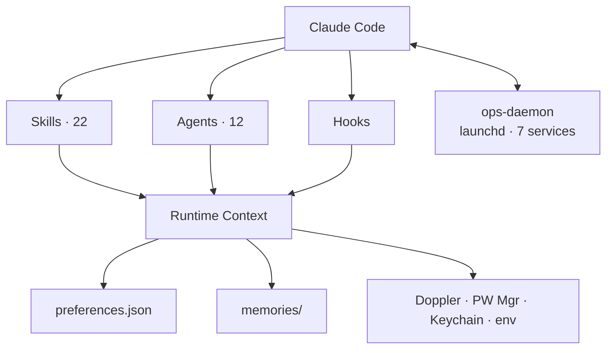

<div align="center">

# claude-ops

**Business Operating System for Claude Code**


**One command. Sixty seconds. Your entire business, at a glance.**

</div>

```
╭──────────────────────────────────────────────────────────────────────────────╮
│  /ops:go  ►  MORNING BRIEFING                              2026-04-12  09:03 │
├─────────────────────────────────┬────────────────────────────────────────────┤
│  INFRA    ████████████████  ok  │  ECS: 4/4 healthy  RDS: ok  Redis: ok     │
│  CI/CD    ████████████░░░░  75% │  3 passing  1 failing  (my-api #847)  │
│  INBOX    ░░░░░░░░░░░░░░░░  14  │  Slack: 9  Telegram: 3  Gmail: 2 unread   │
│  PRs      ████████████████  3   │  3 ready to merge  1 needs review          │
│  SPRINT   ████████████░░░░  67% │  Sprint 24  —  8 of 12 issues complete     │
│  REVENUE  ████████████████  $   │  $2,847 MTD  ↑12% vs last month           │
├─────────────────────────────────┴────────────────────────────────────────────┤
│  Next action: merge feat/user-profile  ·  fix my-api CI  ·  reply @alice    │
╰──────────────────────────────────────────────────────────────────────────────╯
```

Turn Claude Code into a complete business operating system — infrastructure health, CI/CD status, unified inbox, open PRs, sprint state, revenue snapshot (Stripe + RevenueCat + AWS), and autonomous C-suite agents that act on your behalf.

---

## Quick Start

```bash
# 1. Add the marketplace
/plugin marketplace add Lifecycle-Innovations-Limited/claude-ops

# 2. Install the plugin
/plugin install ops@lifecycle-innovations-limited-claude-ops

# 3. Run the guided setup wizard
/ops:setup
```

> [!TIP]
> **The wizard installs the background daemon EARLY (Step 2c).** While you're still answering "connect Slack? [OAuth/Skip]" questions, `briefing-pre-warm` is already running every 2 minutes — pre-fetching ECS health, git state, PRs, CI, and unread counts. By the time setup finishes, your first `/ops:go` briefing loads in **<3 seconds** from warm cache instead of ~30s cold.

**Local development:**

```bash
git clone https://github.com/Lifecycle-Innovations-Limited/claude-ops.git
claude --plugin-dir ./claude-ops/claude-ops
```

---

## Commands

All 22 skills, grouped by category:

| 🧭 Navigation | 📊 Daily Ops |
|---|---|
| `/ops` — pixel-art dashboard | `/ops:go` — morning briefing |
| `/ops:dash` — same + hotkeys | `/ops:next` — priority next action |
| `/ops:setup` — guided wizard | `/ops:inbox` — deep-context inbox zero |
| `/ops:uninstall` — clean removal | `/ops:comms` — send/read any channel |
|                                   | `/ops:merge` — autonomous PR pipeline |

| 🛠️ Project & Eng | 💰 Business |
|---|---|
| `/ops:projects` — portfolio | `/ops:revenue` — **Stripe + RevenueCat** + AWS |
| `/ops:linear` — sprint board | `/ops:ecom` — Shopify operations |
| `/ops:triage` — cross-platform issues | `/ops:marketing` — Klaviyo/Meta/GA4/GSC |
| `/ops:fires` — incidents + **all AWS** | `/ops:voice` — Bland AI/ElevenLabs/Whisper |
| `/ops:deploy` — ECS/Vercel/Actions | |

| 🤖 Automation | 🧰 Maintenance |
|---|---|
| `/ops:orchestrate` — parallel engine | `/ops:speedup` — **OS+HW adaptive** |
| `/ops:yolo` — 4 parallel C-suite agents | `/ops:doctor` — plugin auto-repair |

### Skill routing

```mermaid
flowchart TD
    U[User] --> O[/ops]
    O --> D[Dashboard]
    D --> Daily[Daily Ops]
    D --> Eng[Project & Eng]
    D --> Biz[Business]
    D --> Auto[Automation]
    Daily --> go[/ops:go]
    Daily --> inbox[/ops:inbox]
    Daily --> merge[/ops:merge]
    Eng --> projects[/ops:projects]
    Eng --> linear[/ops:linear]
    Eng --> fires[/ops:fires]
    Biz --> revenue[/ops:revenue]
    Biz --> ecom[/ops:ecom]
    Biz --> marketing[/ops:marketing]
    Auto --> yolo[/ops:yolo]
    Auto --> orchestrate[/ops:orchestrate]
```

---

## Before / After

```
┌────────────────────────────────────────────┬──────────────────────────────────────────────┐
│  WITHOUT claude-ops                        │  WITH claude-ops                             │
├────────────────────────────────────────────┼──────────────────────────────────────────────┤
│  Open 6+ tabs every morning                │  /ops:go  ——  one command, done              │
│  Context-switch between Slack/Telegram/    │  /ops:inbox  ——  unified view, all channels  │
│  email                                     │                                              │
│  Manually review and merge PRs one by one  │  /ops:merge  ——  autonomous pipeline         │
│  SSH into servers to check health          │  /ops:fires  ——  terminal dashboard          │
│  Forget to track AWS spend                 │  /ops:revenue  ——  automatic cost snapshot   │
│  Switch between Linear and GitHub          │  /ops:linear + /ops:projects  ——  unified    │
└────────────────────────────────────────────┴──────────────────────────────────────────────┘
```

---

## Integrations (22 services)

Most integrations offer two paths — MCP (zero-config OAuth) or CLI (fuller feature set). The setup wizard lets you choose per-integration.

| SERVICE | MCP | CLI | WHAT YOU LOSE WITHOUT CLI |
|---|---|---|---|
| GitHub | — | `gh` (auto) | EVERYTHING — CI logs, PR merge, triage all require `gh` |
| AWS | — | `aws` (auto) | EVERYTHING — 17+ services probed by `infra-monitor` |
| **Stripe** | — | **API key** | **Required for `/ops:revenue` MRR — web + desktop subs** |
| **RevenueCat** | — | **API key + project ID** | **Required for mobile-app subscription MRR** |
| Linear | OAuth via Claude.ai (12 tools) | — | Nothing — fully covered |
| Vercel | OAuth via Claude.ai | — | Nothing — deploy status, build + runtime logs |
| Slack | OAuth via Claude.ai | local bot token | MCP covers most. Token adds: unlimited search, private ch |
| Gmail | OAuth (read) | `gog` (send+archive) | MCP = read-only. CLI = full autonomous inbox |
| Calendar | OAuth via Claude.ai | `gog` (read-only) | MCP has more features — either works |
| Sentry | OAuth via Claude.ai | `sentry-cli` | MCP covers triage. CLI adds source maps + releases |
| WhatsApp | — | `wacli` | EVERYTHING — no MCP exists |
| Telegram | — | bundled MCP server | EVERYTHING — plugin ships its own MTProto server |
| Shopify | — | Admin API + template | Store ops, order mgmt, inventory via `/ops:ecom` |
| Klaviyo | — | API key | Email/SMS campaigns via `/ops:marketing` |
| Meta Ads | — | API token | Paid-social reporting via `/ops:marketing` |
| GA4 | — | service account | Analytics via `/ops:marketing` |
| GSC | — | service account | Search Console via `/ops:marketing` |
| Bland AI | — | API key | Outbound voice via `/ops:voice` |
| ElevenLabs | — | API key | TTS + cloning via `/ops:voice` |
| Whisper | — | API key | Transcription via `/ops:voice` |
| GSD | — | auto-detected | Optional — roadmap state; degrades gracefully |
| Doppler | — | `doppler` CLI | Optional secret source; falls through to next resolver |

> [!NOTE]
> **`infra-monitor` now covers every AWS service you have IAM for** — ECS, EC2, RDS, Lambda, S3, CloudFront, ALB/NLB, API Gateway, SQS, SNS, DynamoDB, ElastiCache, Route 53, ACM, CloudWatch, Budgets, IAM. Probes run in parallel; services you can't access are silently skipped.

---

## Architecture



All skills use pre-execution shell blocks (`!` fences) that gather data *before* model context loads — zero extra latency, minimal token overhead. The `ops-daemon` pre-warms briefing data so `/ops:go` hits warm cache.

> **Why the nested `claude-ops/claude-ops/` directory?** Claude Code's plugin marketplace system requires a two-level layout: the **repo root** acts as a marketplace container (with `.claude-plugin/marketplace.json` pointing `"source": "./claude-ops"`), while the **inner directory** is the actual plugin root (with `.claude-plugin/plugin.json`, skills, agents, etc.). This is how Claude Code resolves and caches plugins — it cannot be flattened.

```
claude-ops/                        ← marketplace root (this repo, this README)
├── .claude-plugin/
│   └── marketplace.json           # points to ./claude-ops as plugin source
├── README.md                      # ← you are here
│
└── claude-ops/                    ← plugin root (Claude Code loads from here)
    ├── .claude-plugin/plugin.json
    ├── CLAUDE.md                  # 5 non-negotiable plugin rules
    ├── skills/                    # 22 slash commands
    ├── agents/                    # 12 autonomous agents (Opus/Sonnet/Haiku)
    ├── bin/                       # ops-gather · ops-shopify-create · gog fallback
    ├── hooks/                     # SessionStart health check
    ├── telegram-server/           # bundled MCP server (gram.js)
    ├── templates/                 # Shopify Admin + app scaffolding
    ├── tests/                     # bash validation · test-no-secrets.sh
    └── .mcp.json                  # MCP server declarations
```

---

## Privacy & Security

> [!IMPORTANT]
> **Transparency matters.** claude-ops reads from your AWS, GitHub, Linear, Sentry, WhatsApp, Email, Slack, Telegram, Shopify, Stripe, RevenueCat, and more. You should know exactly what it touches.

**Credential resolution chain (in order):** Doppler → 1Password/Dashlane/Bitwarden → macOS Keychain → env vars → Claude Code's encrypted `userConfig` (`~/.claude.json`).

**Setup auto-scan sources (only during `/ops:setup`):** env, shell profiles, Doppler, 1Password, Dashlane, Bitwarden, macOS Keychain, Claude Code's `~/.claude.json`, Chrome history URL list (never page content), Slack Playwright profile (only if chosen).

**The plugin does NOT:**
- Phone home. No telemetry. No analytics. No crash reports.
- Upload data to any third party you haven't configured.
- Access clipboard, camera, microphone, or SSH keys.
- Perform disk-wide scans — every scan is a targeted path.

**Background daemon services (only those you enable):**
- `briefing-pre-warm` every 2 min — parallel `ops-gather` for ECS/git/PRs/CI/unread. Local only.
- `wacli-sync` continuous — WhatsApp Web protocol, same as standalone `wacli`.
- `memory-extractor` every 30 min — Haiku summarizes local chats to `memories/`.
- `inbox-digest` every 4h — aggregates for your configured Telegram bot (if any).
- `store-health` daily 9am — Shopify Admin API, read-only.
- `competitor-intel` weekly — your configured competitor feeds.
- `message-listener` continuous — local polling, never sends outbound on its own.

**Security measures:** `umask 077` on preferences.json · credentials in Claude Code's encrypted `userConfig` · registry/preferences gitignored · `tests/test-no-secrets.sh` pre-commit · Rule 5 blocks destructive actions without confirmation · append-only shell profile writes.

**Your rights:** `/ops:uninstall` removes everything · memory files are plain markdown · MIT licensed, source is public and auditable.

See the [Privacy & Security wiki page](https://github.com/Lifecycle-Innovations-Limited/claude-ops/wiki/Privacy-and-Security) for the full scan inventory and threat model.

---

## Requirements

Just [Claude Code](https://claude.ai/code) 1.0+. Everything else is installed automatically by `/ops:setup` via Homebrew (macOS), apt (Linux), or winget (Windows). `/ops:speedup` auto-detects macOS / Linux / WSL / Windows and applies host-appropriate tuning (no manual flags needed).

---

## What's New in v1.1.0

- **CLAUDE.md plugin rules** — 5 non-negotiable rules enforced across every skill
- **Shopify Admin template** + `bin/ops-shopify-create`
- **Early daemon install at setup Step 2c** — `briefing-pre-warm` runs every 2 min so `/ops:go` loads in <3s
- **All scanner/fix/daemon agents bumped to Sonnet 4.6** · C-suite agents on **Opus 4.6**
- **`yolo-ceo` now runs as a parallel peer** (not synthesizer) — the main `/ops:yolo` skill synthesizes all 4 C-suite reports
- **`/ops:revenue` tracks actual revenue** via Stripe + RevenueCat
- **`infra-monitor` covers every accessible AWS service** (17+ services probed)
- **`gog` install fix** — npm/bun → git-clone fallback
- **`/ops:speedup` OS+hardware-adaptive** — macOS / Linux / WSL / Windows
- **Agent Teams adoption** — `TeamCreate` + `SendMessage` in 6 parallel-dispatch skills
- **AskUserQuestion ≤4 compliance** — all 22 skills audited, batch `[More options...]` bridges
- **10-source credential auto-scan** + deep-hunt agent fallback

---

## Contributing

PRs welcome — see [CONTRIBUTING.md](./CONTRIBUTING.md) for the full guide, branch rules, and PR workflow.

**Branch strategy:** `main` is the only long-lived branch. All work goes through feature branches → PR to `main`. Branch protection is enforced at repo and org level — no direct pushes, no force pushes, no branch deletion.

```bash
# Development mode — load plugin from local directory
claude --plugin-dir ./claude-ops/claude-ops

# Reload after changes
/reload-plugins
```

See [`claude-ops/README.md`](./claude-ops/README.md) for detailed documentation on each skill, agent, and integration. Full guides, troubleshooting, and the threat model live on the [wiki](https://github.com/Lifecycle-Innovations-Limited/claude-ops/wiki).

---

## License

[MIT](./claude-ops/LICENSE) — built by [Lifecycle Innovations Limited](https://github.com/Lifecycle-Innovations-Limited).

<div align="center">

**v1.1.0 · MIT · github.com/Lifecycle-Innovations-Limited**

</div>
