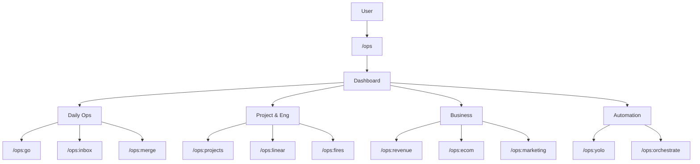
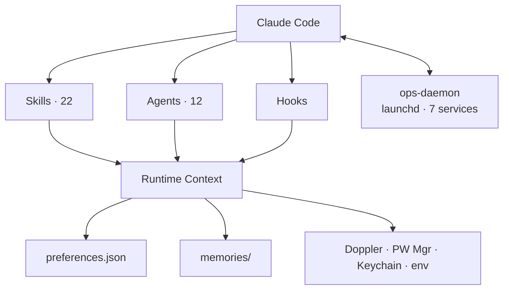

<div align="center">

# claude-ops

**Business Operating System for Claude Code**


**One command. Sixty seconds. Your entire business, at a glance.**

</div>

```
╭──────────────────────────────────────────────────────────────────────────────╮
│  /ops:go  ►  MORNING BRIEFING                              2026-04-12  09:03 │
├─────────────────────────────────┬────────────────────────────────────────────┤
│  INFRA    ████████████████  ok  │  ECS: 4/4 healthy  RDS: ok  Redis: ok     │
│  CI/CD    ████████████░░░░  75% │  3 passing  1 failing  (my-api #847)  │
│  INBOX    ░░░░░░░░░░░░░░░░  14  │  Slack: 9  Telegram: 3  Gmail: 2 unread   │
│  PRs      ████████████████  3   │  3 ready to merge  1 needs review          │
│  SPRINT   ████████████░░░░  67% │  Sprint 24  —  8 of 12 issues complete     │
│  REVENUE  ████████████████  $   │  $2,847 MTD  ↑12% vs last month           │
├─────────────────────────────────┴────────────────────────────────────────────┤
│  Next action: merge feat/user-profile  ·  fix my-api CI  ·  reply @alice    │
╰──────────────────────────────────────────────────────────────────────────────╯
```

Turn Claude Code into a complete business operating system — infrastructure health, CI/CD status, unified inbox, open PRs, sprint state, revenue snapshot (Stripe + RevenueCat + AWS), and autonomous C-suite agents that act on your behalf.

---

## What's new in v2.0

v2 turns claude-ops from a _briefing + comms surface_ into an **autonomy layer for Claude Code itself.** Purely additive — no v1 behaviour changes by default. See [`claude-ops/CHANGELOG.md`](claude-ops/CHANGELOG.md#200--2026-04-26) and [`docs/migrating-from-v1.md`](claude-ops/docs/migrating-from-v1.md).

| Capability                                                                                                                                                                                    | Skill                                                                                                                      | Doc                                                                     |
| --------------------------------------------------------------------------------------------------------------------------------------------------------------------------------------------- | -------------------------------------------------------------------------------------------------------------------------- | ----------------------------------------------------------------------- |
| Post-merge + build-failure auto-fix (PostToolUse hooks → headless Haiku fixer)                                                                                                                | [`/ops:deploy-fix`](claude-ops/skills/ops-deploy-fix/SKILL.md)                                                             | [deploy-fix.md](claude-ops/docs/deploy-fix.md)                          |
| Pre-installed specialist agents + silent `general-purpose` → specialist routing                                                                                                               | (transparent)                                                                                                              | [agents.md](claude-ops/docs/agents.md)                                  |
| Universal safety hooks: secret-scan, `rm -rf` anchor block, `main` push warn                                                                                                                  | (always-on)                                                                                                                | [safety-hooks.md](claude-ops/docs/safety-hooks.md)                      |
| Recap marquee — multi-session digest in tmux `status-right` / `statusLine`                                                                                                                    | [`/ops:recap`](claude-ops/skills/ops-recap/SKILL.md)                                                                       | [recap.md](claude-ops/docs/recap.md)                                    |
| Multi-account Claude Max rotator with launchd daemon + AI-brain (jittered post-rotation respawn + `/login` re-auth so a freshly-rotated account isn't hit by a synchronized first-call burst) | [`/ops:rotate`](claude-ops/skills/ops-rotate/SKILL.md), [`/ops:rotate-setup`](claude-ops/skills/ops-rotate-setup/SKILL.md) | [CHANGELOG](claude-ops/CHANGELOG.md#6-multi-account-claude-max-rotator) |
| Periodic Task\* tracking nudge                                                                                                                                                                | (PostToolUse hook)                                                                                                         | [CHANGELOG](claude-ops/CHANGELOG.md#4-universal-task-tracking-nudge)    |
| Windsor.ai live marketing data source for ops dashboards, marketing, socials & ecom                                                                                                           | [`/ops:marketing`](claude-ops/skills/ops-marketing/SKILL.md)                                                               | [windsor-ai.md](docs/integrations/windsor-ai.md)                        |

### Quick start for the auto-fix subsystem

```bash
# 1. Upgrade
/plugin update ops@lifecycle-innovations-limited-claude-ops

# 2. Run the wizard (hits new steps 6.5a–6.5d for v2 toggles)
/ops:setup

# 3. Map your repos to their deploy URLs
/ops:deploy-fix configure
# (opens ~/.claude/config/post-merge-services.json)

# 4. From now on, every `gh pr merge` you run from Claude Code will:
#    - poll the deploy workflow
#    - curl /health on success
#    - verify /version returns the merged SHA
#    - on failure: auto-rerun transients, OR dispatch a Haiku deploy-fixer
/ops:deploy-fix          # see status / budget / live runs
```

Per-repo budget caps (default 3/hour), single-flight locks, and content-hash dedup prevent runaway spending. Notifications route via `macos`/`ntfy`/`pushover`/`discord`/`telegram`/`none`. Every toggle is spacebar-toggleable in `/plugins` settings.

---

## Quick Start

```bash
# 1. Add the marketplace
/plugin marketplace add Lifecycle-Innovations-Limited/claude-ops

# 2. Install the plugin
/plugin install ops@lifecycle-innovations-limited-claude-ops

# 3. Run the guided setup wizard
/ops:setup
```

### Cross-CLI install (Claude Code + Codex + Gemini + OpenClaw + Hermes + OpenCode)

```bash
npx claude-ops-installer install
```

One command mirrors upstream skills + binstubs into every detected CLI's expected layout from a single central config (`~/.config/claude-ops-installer/config.yaml`). See [`installer/README.md`](./installer/README.md) for the schema, supported agents, and `verify` / `doctor` / `update` / `uninstall` subcommands.

> [!TIP]
> **The wizard installs the background daemon EARLY (Step 2c).** While you're still answering "connect Slack? [OAuth/Skip]" questions, `briefing-pre-warm` is already running every 2 minutes — pre-fetching ECS health, git state, PRs, CI, and unread counts. By the time setup finishes, your first `/ops:go` briefing loads in **<3 seconds** from warm cache instead of ~30s cold.

**Local development:**

```bash
git clone https://github.com/Lifecycle-Innovations-Limited/claude-ops.git
claude --plugin-dir ./claude-ops/claude-ops
```

---

## Commands

All 61 skills, grouped by category:

| 🧭 Navigation                    | 📊 Daily Ops                           |
| -------------------------------- | -------------------------------------- |
| `/ops` — pixel-art dashboard     | `/ops:go` — morning briefing           |
| `/ops:dash` — same + hotkeys     | `/ops:next` — priority next action     |
| `/ops:setup` — guided wizard     | `/ops:inbox` — deep-context inbox zero |
| `/ops:uninstall` — clean removal | `/ops:comms` — send/read any channel   |
|                                  | `/ops:merge` — autonomous PR pipeline  |

| 🛠️ Project & Eng                                                  | 💰 Business                                                      |
| ----------------------------------------------------------------- | ---------------------------------------------------------------- |
| `/ops:projects` — **portfolio dashboard**                         | `/ops:revenue` — **Stripe + RevenueCat** + AWS                   |
| `/ops:linear` — sprint board                                      | `/ops:ecom` — Shopify operations                                 |
| `/ops:triage` — cross-platform issues                             | `/ops:marketing` — Klaviyo/Meta/GA4/GSC                          |
| `/ops:fires` — incidents + **all AWS**                            | `/ops:gtm` — **cross-channel GTM planner**                       |
| `/ops:deploy` — ECS/Vercel/Actions                                | `/ops:voice` — **native + Twilio + Bland + Zoom + smart `join`** |
| `/ops:monitor` — Datadog/New Relic/OTEL                           | `/ops:package` — carrier-agnostic shipping                       |
| `/ops:competitors` — **self-discovering competitor intel** (v2.3) |                                                                  |

| 🤖 Automation                           | 🧰 Maintenance                                         |
| --------------------------------------- | ------------------------------------------------------ |
| `/ops:orchestrate` — parallel engine    | `/ops:speedup` — **GPU/ANE + power hogs + OS actions** |
| `/ops:yolo` — 4 parallel C-suite agents | `/ops:doctor` — plugin auto-repair                     |
| `/ops:integrate` — add external service | `/ops:daemon` — launchd background brain               |
| `/ops:whatsapp-biz` — catalog/orders    | `/ops:status` — plugin + daemon health                 |

### Voice / phone / video (v2.9)

`/ops:voice` is a full voice surface — not just AI calls.

| Subcommand                    | What it does                                                                                                                                        |
| ----------------------------- | --------------------------------------------------------------------------------------------------------------------------------------------------- |
| `phone <number>`              | Native Phone.app dial via Continuity                                                                                                                |
| `facetime <handle> [--audio]` | FaceTime video or audio                                                                                                                             |
| `zoom start\|join\|schedule`  | Native Zoom + REST scheduling                                                                                                                       |
| `join [--at now\|next]`       | Auto-joins the current/next calendar meeting with smart AV defaults (cam/mic policy by attendee count, lid-state mic switching, Elgato auto-launch) |
| `twilio-call`, `twilio-sms`   | Programmatic outbound voice + SMS                                                                                                                   |
| `bland-call`                  | AI agent phone call                                                                                                                                 |
| `tts`, `transcribe`           | ElevenLabs TTS + Groq Whisper                                                                                                                       |

All outbound 1:1 channels (twilio, bland) go through the per-message approval gate (Rule 6).

### Skill routing



---

## Before / After

```
┌────────────────────────────────────────────┬──────────────────────────────────────────────┐
│  WITHOUT claude-ops                        │  WITH claude-ops                             │
├────────────────────────────────────────────┼──────────────────────────────────────────────┤
│  Open 6+ tabs every morning                │  /ops:go  ——  one command, done              │
│  Context-switch between Slack/Telegram/    │  /ops:inbox  ——  unified view, all channels  │
│  email                                     │                                              │
│  Manually review and merge PRs one by one  │  /ops:merge  ——  autonomous pipeline         │
│  SSH into servers to check health          │  /ops:fires  ——  terminal dashboard          │
│  Forget to track AWS spend                 │  /ops:revenue  ——  automatic cost snapshot   │
│  Switch between Linear and GitHub          │  /ops:linear + /ops:projects  ——  unified    │
└────────────────────────────────────────────┴──────────────────────────────────────────────┘
```

---

## Integrations (22 services)

Most integrations offer two paths — MCP (zero-config OAuth) or CLI (fuller feature set). The setup wizard lets you choose per-integration.

| SERVICE                | MCP                            | CLI                                                      | WHAT YOU LOSE WITHOUT CLI                                            |
| ---------------------- | ------------------------------ | -------------------------------------------------------- | -------------------------------------------------------------------- |
| GitHub                 | —                              | `gh` (auto)                                              | EVERYTHING — CI logs, PR merge, triage all require `gh`              |
| AWS                    | —                              | `aws` (auto)                                             | EVERYTHING — 17+ services probed by `infra-monitor`                  |
| **Stripe**             | —                              | **API key**                                              | **Required for `/ops:revenue` MRR — web + desktop subs**             |
| **RevenueCat**         | —                              | **API key + project ID**                                 | **Required for mobile-app subscription MRR**                         |
| Linear                 | OAuth via Claude.ai (12 tools) | —                                                        | Nothing — fully covered                                              |
| Vercel                 | OAuth via Claude.ai            | —                                                        | Nothing — deploy status, build + runtime logs                        |
| Slack                  | OAuth via Claude.ai            | local bot token                                          | MCP covers most. Token adds: unlimited search, private ch            |
| Gmail                  | OAuth (read)                   | `gog` (send+archive)                                     | MCP = read-only. CLI = full autonomous inbox                         |
| Calendar               | OAuth via Claude.ai            | `gog` (read-only)                                        | MCP has more features — either works                                 |
| Sentry                 | OAuth via Claude.ai            | `sentry-cli`                                             | MCP covers triage. CLI adds source maps + releases                   |
| WhatsApp               | —                              | `wacli`                                                  | EVERYTHING — no MCP exists                                           |
| Telegram               | —                              | bundled MCP server                                       | EVERYTHING — plugin ships its own MTProto server                     |
| Shopify                | —                              | Admin API + template                                     | Store ops, order mgmt, inventory via `/ops:ecom`                     |
| Klaviyo                | —                              | API key                                                  | Email/SMS campaigns via `/ops:marketing`                             |
| Meta Ads               | —                              | API token                                                | Paid-social reporting via `/ops:marketing`                           |
| GA4                    | —                              | service account                                          | Analytics via `/ops:marketing`                                       |
| GSC                    | —                              | service account                                          | Search Console via `/ops:marketing`                                  |
| Bland AI               | —                              | API key                                                  | Outbound voice via `/ops:voice`                                      |
| ElevenLabs             | —                              | API key                                                  | TTS + cloning via `/ops:voice`                                       |
| Whisper                | —                              | API key                                                  | Transcription via `/ops:voice`                                       |
| Twilio                 | —                              | API (Account SID + Auth Token)                           | Outbound voice + SMS via `/ops:voice twilio-*`                       |
| Zoom                   | Server-to-Server OAuth         | API token                                                | Native start/join (no creds) + REST schedule via `/ops:voice zoom *` |
| macOS Phone / FaceTime | —                              | URL schemes (`tel:`, `facetime://`, `facetime-audio://`) | Native via Continuity — no creds, no API                             |
| Elgato Camera Hub      | —                              | auto-launched if installed                               | Virtual camera setup for meetings via `/ops:voice join`              |
| GSD                    | —                              | auto-detected                                            | Optional — roadmap state; degrades gracefully                        |
| Doppler                | `@dopplerhq/mcp-server` (MCP)  | `doppler` CLI (fallback)                                 | Secrets manager; MCP server provides direct tool access              |

> [!NOTE]
> **`infra-monitor` now covers every AWS service you have IAM for** — ECS, EC2, RDS, Lambda, S3, CloudFront, ALB/NLB, API Gateway, SQS, SNS, DynamoDB, ElastiCache, Route 53, ACM, CloudWatch, Budgets, IAM. Probes run in parallel; services you can't access are silently skipped.

---

## Architecture



All skills use pre-execution shell blocks (`!` fences) that gather data _before_ model context loads — zero extra latency, minimal token overhead. The `ops-daemon` pre-warms briefing data so `/ops:go` hits warm cache.

> **Why the nested `claude-ops/claude-ops/` directory?** Claude Code's plugin marketplace system requires a two-level layout: the **repo root** acts as a marketplace container (with `.claude-plugin/marketplace.json` pointing `"source": "./claude-ops"`), while the **inner directory** is the actual plugin root (with `.claude-plugin/plugin.json`, skills, agents, etc.). This is how Claude Code resolves and caches plugins — it cannot be flattened.

```
claude-ops/                        ← marketplace root (this repo, this README)
├── .claude-plugin/
│   └── marketplace.json           # points to ./claude-ops as plugin source
├── README.md                      # ← you are here
│
└── claude-ops/                    ← plugin root (Claude Code loads from here)
    ├── .claude-plugin/plugin.json
    ├── CLAUDE.md                  # 5 non-negotiable plugin rules
    ├── skills/                    # 22 slash commands
    ├── agents/                    # 12 autonomous agents (Opus/Sonnet/Haiku)
    ├── bin/                       # ops-gather · ops-shopify-create · gog fallback
    ├── hooks/                     # SessionStart health check
    ├── telegram-server/           # bundled MCP server (gram.js)
    ├── templates/                 # Shopify Admin + app scaffolding
    ├── tests/                     # bash validation · test-no-secrets.sh
    └── .mcp.json                  # MCP server declarations
```

---

## Agent Teams

Every ops skill that spawns agents supports [Claude Code Agent Teams](https://docs.anthropic.com/en/docs/claude-code) — a coordination layer where agents share context, report progress, and accept mid-flight steering.

**Enable:** Set `CLAUDE_CODE_EXPERIMENTAL_AGENT_TEAMS=1` in your environment.

**How it works:** When the flag is set, skills create a named team and dispatch agents into it. Agents within a team can share findings (e.g., an inbox agent discovers a Slack message referencing an email thread, so the email agent prioritizes it) and you can steer priorities via `SendMessage`.

```
TeamCreate("fire-fixers")
Agent(team_name="fire-fixers", name="fix-ecs", ...)
Agent(team_name="fire-fixers", name="fix-ci", ...)
SendMessage(to="fix-ecs", content="This is P0, prioritize over CI")
```

**Without the flag:** Skills fall back to standard fire-and-forget subagents — still parallel, but no coordination or steering.

| Skill              | Team name          | Agents                                                           |
| ------------------ | ------------------ | ---------------------------------------------------------------- |
| `/ops:go`          | `go-team`          | infra-scanner, inbox-scanner, pr-scanner, sprint-scanner         |
| `/ops:inbox`       | `inbox-channels`   | whatsapp-scanner, email-scanner, slack-scanner, telegram-scanner |
| `/ops:merge`       | `merge-fixers`     | fixer-[repo] per failing PR                                      |
| `/ops:fires`       | `fire-fixers`      | fix-[service] per active incident                                |
| `/ops:triage`      | `triage-fixers`    | fix-[issue-id] per active issue                                  |
| `/ops:yolo`        | `yolo-csuite`      | ceo, cto, cfo, coo                                               |
| `/ops:orchestrate` | `orchestrate-team` | per-project agents (hybrid auto-select)                          |
| `/ops:monitor`     | `monitor-probes`   | datadog-probe, newrelic-probe, otel-probe                        |
| `/ops:doctor`      | `doctor-fixers`    | fix-manifest, fix-permissions, fix-registry                      |
| `/ops:marketing`   | `marketing-team`   | email-metrics, ads-metrics, analytics-metrics, seo-metrics       |
| `/ops:ecom`        | `ecom-team`        | orders-scanner, inventory-scanner, fulfillment-scanner           |
| `/ops:deploy`      | `deploy-team`      | ecs-checker, vercel-checker, ci-checker                          |
| `/ops:projects`    | `projects-team`    | project-[alias] per registered project                           |
| `/ops:dash`        | `dash-team`        | infra-loader, comms-loader, projects-loader, business-loader     |
| `/ops:next`        | `next-team`        | fires-checker, comms-checker, prs-checker, sprint-checker        |
| `setup`            | `setup-hunters`    | hunt-[service] per credential deep hunt                          |

**Compliance enforced by CI:** `tests/test-agent-teams.sh` audits every skill for Agent Teams support — any skill with `Agent` in its allowed-tools must have `TeamCreate`/`SendMessage`, a documentation section, the feature flag check, and a fallback path.

---

## Competitor Intelligence (v2.3)

A self-discovering competitive-intelligence pipeline that goes well past "weekly Google Alert." Free signals + LLM curation, $0 incremental cost, configurable per brand.

**Pipeline per configured brand:**

1. **Discovery** (Tavily, cached 30d) — surfaces the current competitor landscape for `{brand_name}` in `{category}`.
2. **Per-competitor signal collectors** run in parallel (`scripts/lib/competitor/`):
   - `reddit-search.sh` — Reddit JSON API
   - `hn-search.sh` — HN Algolia API
   - `appstore-lookup.sh` — iTunes Lookup (opt-in for mobile brands)
   - `jobs-feed.sh` — Greenhouse + Lever public APIs (senior-hire detection)
   - `page-diff.sh` — HTML pricing/features/careers SHA snapshots with money-token detection
3. **Severity routing** via `event-router.sh`:
   - `high` (price change on direct rival, funding, Show HN going viral) → immediate Telegram push every 10 min via `competitor-alert` cron
   - `med` → daily 17:00 grouped roll-up via `competitor-daily` cron
   - `low` → state-only, surfaces in weekly strategic synthesis
4. **Weekly synthesis** (Mon 10:00) — `claude_invoke` Sonnet 4.6 against 7-day events.jsonl window. Output: `NEW entrants / Competitor moves / Brand signal / Threats & opportunities`.

**Where it shows up:**

| Surface            | What you see                                                               |
| ------------------ | -------------------------------------------------------------------------- |
| `/ops:go`          | `COMPETITOR` row: alerts count, last_run, top-3 event snippets             |
| `/ops:next`        | Priority 2 (between fires + comms): `REACT: <competitor> <source> changed` |
| `/ops:marketing`   | PRICING MOVES + FUNDING + SENTIMENT section                                |
| `/ops:ecom`        | APP RELEASES + PRODUCT/PRICING CHANGES section                             |
| `/ops:yolo`        | CEO/CTO/CFO/COO agents each load role-specific vertical slice              |
| `/ops:competitors` | Dedicated dashboard + `bin/ops-competitors` CLI                            |
| Disk               | `$DATA_DIR/reports/competitor-intel/YYYY-MM-DD_<brand>.md`                 |

**Config** (`preferences.json .competitor_intel`):

```json
{
  "brand_name": "My-Project",
  "category": "AI health coaching apps",
  "max_competitors": 5,
  "report_timezone": "Europe/Amsterdam",
  "app_store": true,
  "urls": {
    "Noom": { "pricing": "https://www.noom.com/plans/", "features": "..." }
  }
}
```

**Required env:** `TAVILY_API_KEY` (free tier 1000 searches/mo — covers ~30 brands). **Optional:** `TELEGRAM_BOT_TOKEN` + `TELEGRAM_CHAT_ID` for push delivery (otherwise reports persist to disk only).

**Cost at 10-brand scale:** ~13 Tavily calls/wk + ~320k Sonnet tokens/mo on Max-OAuth = **$0 incremental**.

---

## Privacy & Security

> [!IMPORTANT]
> **Transparency matters.** claude-ops reads from your AWS, GitHub, Linear, Sentry, WhatsApp, Email, Slack, Telegram, Shopify, Stripe, RevenueCat, and more. You should know exactly what it touches.

**Credential resolution chain (in order):** Doppler MCP → Doppler CLI → 1Password/Dashlane/Bitwarden → macOS Keychain → env vars → Claude Code's encrypted `userConfig` (`~/.claude.json`).

**Setup auto-scan sources (only during `/ops:setup`):** env, shell profiles, Doppler, 1Password, Dashlane, Bitwarden, macOS Keychain, Claude Code's `~/.claude.json`, Chrome history URL list (never page content), Slack Playwright profile (only if chosen).

**The plugin does NOT:**

- Phone home. No telemetry. No analytics. No crash reports.
- Upload data to any third party you haven't configured.
- Access clipboard, camera, microphone, or SSH keys.
- Perform disk-wide scans — every scan is a targeted path.

**Background daemon services (only those you enable):**

- `briefing-pre-warm` every 2 min — parallel `ops-gather` for ECS/git/PRs/CI/unread. Local only.
- `wacli-sync` continuous — WhatsApp Web protocol, same as standalone `wacli`.
- `memory-extractor` every 30 min — Haiku summarizes local chats to `memories/`.
- `inbox-digest` every 4h — aggregates for your configured Telegram bot (if any).
- `store-health` daily 9am — Shopify Admin API, read-only.
- `competitor-intel` weekly Mon 10:00 — full strategic synthesis for each configured brand (see below).
- `competitor-alert` every 10 min — drains high-severity competitor events to Telegram + `alerts.log`.
- `competitor-daily` daily 17:00 — drains medium-severity events into a grouped roll-up digest.
- `message-listener` continuous — local polling, never sends outbound on its own.

**Security measures:** `umask 077` on preferences.json · credentials in Claude Code's encrypted `userConfig` · registry/preferences gitignored · `tests/test-no-secrets.sh` pre-commit · Rule 5 blocks destructive actions without confirmation · append-only shell profile writes.

**Your rights:** `/ops:uninstall` removes everything · memory files are plain markdown · MIT licensed, source is public and auditable.

See the [Privacy & Security wiki page](https://github.com/Lifecycle-Innovations-Limited/claude-ops/wiki/Privacy-and-Security) for the full scan inventory and threat model.

---

## Requirements

Just [Claude Code](https://claude.ai/code) 1.0+. Everything else is installed automatically by `/ops:setup` via Homebrew (macOS), apt (Linux), or winget (Windows). `/ops:speedup` auto-detects macOS / Linux / WSL / Windows and applies host-appropriate tuning (no manual flags needed).

---

## What's New in v1.7.0

- **`/gtm` — cross-channel go-to-market planner** (NEW skill). Strategy layer on top of `/ops:marketing` that generates plans across paid, unpaid, sales, and AI-automation avenues and hands launchable items to `/marketing` via the `Skill` tool.
- **`/ops:projects` portfolio dashboard** — every project in the GSD registry with active phase, task count, dirty-file count, and open-PR status. Backed by the `gsd-registry-sync` daemon service.
- **`ops-speedup` v2 parity** — `--gpu` (Neural Engine + GPU util via `powermetrics`), `--power` (energy hogs from `top -o pmem`), `--os-actions` (cross-platform kernel_task / WindowServer restarts + launchd/systemd masking behind an allowlist). Hardened against 9 review findings including a SEV-9 `eval` shell-injection and a SEV-8 RETURN-trap race.
- **`ops-memory-extractor` Claude Code OAuth support** — prefers the OAuth token stored in the macOS Keychain (`Claude Code-credentials`) so memory extraction is billed against the Claude Max subscription instead of the API credit. Falls back to `ANTHROPIC_API_KEY`. The OAuth token is never exported to the shell.
- **Persistent WhatsApp `--follow`** — `wacli-keepalive.sh` no longer tears down the follower within 5-20 min of start. `INITIAL_BACKFILL_DELAY=30` lets the follower stabilize before the first `--once` sweep, and a reentrant guard prevents overlapping sweeps.
- **MCP auto-reconnect** — `PreToolUse` hook kills and respawns any disconnected MCP server without user prompting.
- **57 skills, 21 agents** — up from 21/12 in v0.6.0. Full list in [`claude-ops/README.md`](./claude-ops/README.md#features).
- **Models:** C-suite on **Opus 4.6**, scanners/monitors/fix agents on **Sonnet 4.6**, memory extractor on **Haiku 4.5**.

---

## Contributing

PRs welcome — see [CONTRIBUTING.md](./CONTRIBUTING.md) for the full guide, branch rules, and PR workflow.

**Branch strategy:** `main` is the only long-lived branch. All work goes through feature branches → PR to `main`. Branch protection is enforced at repo and org level — no direct pushes, no force pushes, no branch deletion.

```bash
# Development mode — load plugin from local directory
claude --plugin-dir ./claude-ops/claude-ops

# Reload after changes
/reload-plugins
```

See [`claude-ops/README.md`](./claude-ops/README.md) for detailed documentation on each skill, agent, and integration. Full guides, troubleshooting, and the threat model live on the [wiki](https://github.com/Lifecycle-Innovations-Limited/claude-ops/wiki).

---

## License

[MIT](./claude-ops/LICENSE) — built by [Lifecycle Innovations Limited](https://github.com/Lifecycle-Innovations-Limited).

<div align="center">

**v1.7.0 · MIT · github.com/Lifecycle-Innovations-Limited**

</div>
