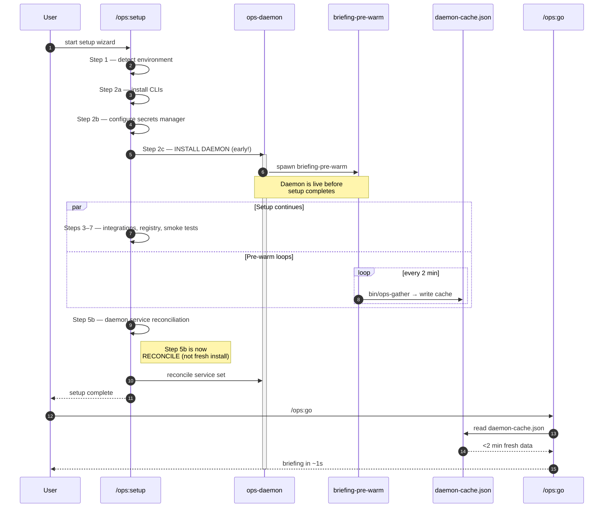

<div align="center">

# Daemon Guide

*The unified background process manager that pre-warms briefings, syncs WhatsApp, extracts memories, and watches your fires — persistently, via launchd*

[](../CHANGELOG.md)
[](.)
[](.)
[](.)

</div>

---

The **ops-daemon** is a unified background process manager that runs persistently via macOS launchd. It replaced per-service launchd agents (introduced in v0.5.0, expanded in v0.8.0).

> [!NOTE]
> As of **v0.8.0**, the daemon installs at **setup Step 2c** (not 5b) so it begins pre-warming the briefing cache while the rest of setup is still running. By the time you finish configuring integrations, `/ops:go` is already instant.

---

## 🧭 What the Daemon Does

The daemon supervises **seven** long-lived services:

| Service | Cadence | Purpose |
|---------|---------|---------|
| `briefing-pre-warm` | every **2 min** | Runs `bin/ops-gather` to keep `/ops:go` cache hot |
| `wacli-sync` | persistent | Keeps WhatsApp connected, auto-reconnects, backfills `@lid` chats |
| `memory-extractor` | every 30 min | Spawns `memory-extractor` agent to refresh `memories/` |
| `inbox-digest` | every 15 min | Pre-classifies comms across channels for `/ops:inbox` |
| `store-health` | every 10 min | Shopify orders + inventory polling (if configured) |
| `competitor-intel` | hourly | Background market/competitor monitoring |
| `message-listener` | persistent | Surfaces urgent patterns (your name, "urgent", "ASAP", "fire", "down") |

> [!TIP]
> The `briefing-pre-warm` service is what makes `/ops:go` feel instant. It runs `bin/ops-gather` every 2 minutes so the cache is always <2 min stale when you ask.

---

## ⚡ The Pre-Warm Strategy

Installing the daemon at **setup Step 2c** is a deliberate optimisation. While you're still clicking through OAuth prompts and pasting API keys in Steps 3–7, the daemon is already warming your briefing cache in the background.



> [!IMPORTANT]
> **Step 5b changed in v0.8.0.** It used to be "install daemon + launchd plist" (fresh install). It is now "**daemon service reconciliation**" — the daemon is already running from Step 2c; Step 5b just reconciles the active service set with whatever integrations the user configured in Steps 3–7 (enables `store-health` only if Shopify was configured, etc.).

---

## 🛠️ Setup

The daemon is configured automatically by the setup wizard:

```
/ops:setup
# Step 2c: Install ops-daemon + briefing-pre-warm (early install)
# Step 5b: Daemon service reconciliation (enable/disable per integration)
```

Or manage it manually:

```bash
# Start via launchd (recommended — survives reboots)
launchctl load ~/Library/LaunchAgents/com.claude-ops.daemon.plist

# Start foreground (debug mode)
~/.claude/plugins/cache/ops-marketplace/ops/<version>/scripts/ops-daemon.sh start

# Check status
~/.claude/plugins/cache/.../scripts/ops-daemon.sh status

# List active services
~/.claude/plugins/cache/.../scripts/ops-daemon.sh services
```

The daemon script lives at `scripts/ops-daemon.sh`.

> [!TIP]
> Run `/ops:doctor` anytime the daemon misbehaves. It diagnoses missing plists, stale PIDs, failed services, and reconciles the service set for you.

---

## 📋 Health File Contract

The daemon writes `~/.wacli/.health` on every successful wacli sync. Skills read this file before any WhatsApp operation.

```json
{
  "status": "ok",
  "last_sync": "2026-04-13T07:45:00Z",
  "wacli_pid": 12345,
  "message_count": 1420
}
```

| Field | Meaning |
|-------|---------|
| `status` | `ok`, `degraded`, or `down` |
| `last_sync` | ISO timestamp of last successful wacli poll |
| `wacli_pid` | PID of the running wacli process |
| `message_count` | Total messages in local DB |

> [!WARNING]
> If `last_sync` is more than **10 minutes** ago, the PreToolUse hook surfaces a warning before any WhatsApp command. Running `/ops:doctor` will auto-restart the daemon if this happens.

---

## 🪝 PreToolUse Hook

`hooks/whatsapp-health-check.sh` runs automatically before any `wacli` call. It checks the health file and either:
- Proceeds silently if `status === ok` and `last_sync` is recent
- Surfaces a warning with instructions to restart the daemon if degraded

The hook is registered in `.claude/settings.json` under `preToolUse`.

---

## 🧠 Brain Layer

The daemon includes a lightweight brain layer (`bin/ops-brain`) that:
- Pre-fetches briefing data every **2 minutes** via `briefing-pre-warm` and caches it to `~/.claude/plugins/data/.../daemon-cache.json`
- Detects urgent message patterns (mentions of your name, "urgent", "ASAP", "fire", "down")
- Writes urgent flags to the health file so `/ops:go` can surface them instantly

This makes `/ops:go` load in under **3 seconds** instead of gathering data live (typically ~1s off a hot cache).

---

## 🔧 Troubleshooting

```bash
# View daemon logs
tail -f /tmp/com.claude-ops.daemon.log

# View a specific service's logs
tail -f /tmp/com.claude-ops.briefing-pre-warm.log
tail -f /tmp/com.claude-ops.memory-extractor.log

# Force restart
launchctl unload ~/Library/LaunchAgents/com.claude-ops.daemon.plist
launchctl load ~/Library/LaunchAgents/com.claude-ops.daemon.plist

# Run doctor to auto-fix daemon issues
/ops:doctor
```

Common issues:

| Symptom | Likely cause | Fix |
|---------|--------------|-----|
| `wacli not connected` | Auth expired | `/ops:setup whatsapp` to re-authenticate |
| `health file stale` | Daemon crashed | Check `/tmp/com.claude-ops.daemon.log`, restart via launchctl |
| `memory extractor not running` | Missing Haiku API key | Configure in preferences or Doppler |
| `briefing-pre-warm errors` | `bin/ops-gather` failing | Run `bin/ops-gather` manually to see the error, often a missing CLI |
| `Step 5b keeps re-enabling stopped services` | Expected — reconciliation enables anything configured | Use `ops-daemon.sh disable <service>` to opt out |

> [!CAUTION]
> Don't manually delete `~/Library/LaunchAgents/com.claude-ops.daemon.plist` while the daemon is running — launchctl will leave orphan processes. Always `launchctl unload` first, then remove the plist.
