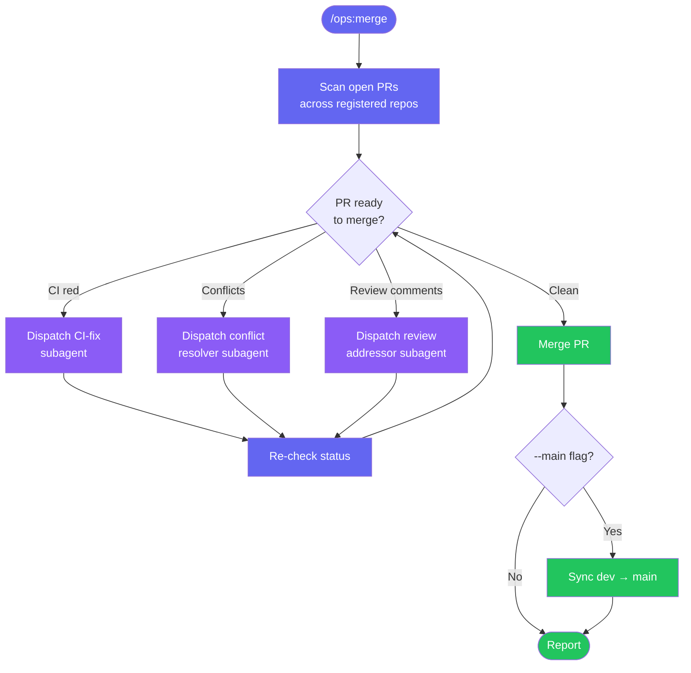
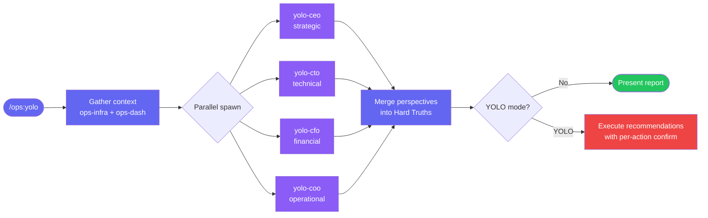

# Skills Reference

*All 21 skills available in claude-ops — your business operations command surface*

---

Skills live in `skills/<name>/SKILL.md`.

> [!NOTE]
> Skills are the user-facing slash commands. They route work to agents, orchestrate multi-step flows, and present results. See [`agents-reference.md`](agents-reference.md) for the agents they spawn.

## 🧩 AskUserQuestion Batching Pattern

All skills enforce a hard limit of **<=4 options per `AskUserQuestion` call** (plugin-root CLAUDE.md rule, enforced by the tool schema). When a menu has more than 4 entries, apply this strategy:

1. **Filter first** — remove already-configured, completed, or irrelevant items. Often brings count to <=4.
2. **Batch with "More..."** — split remaining items into sequential calls of <=4. Last option in each non-final batch is `[More options...]` to advance to the next batch.
3. **Paginate dynamic lists** — any runtime list (projects, configs) that may exceed 4 items must be paginated at 4 per page.

> [!IMPORTANT]
> Passing more than 4 options causes an `InputValidationError` and the skill crashes. Always filter and batch.

Examples in this release: setup section picker (11 items → 4+4+3), setup channel picker (7 items → 4+3), ops-comms / deploy / fires / go / inbox / linear / projects / revenue / speedup / triage / yolo all use "More..." bridges where needed. ops-dash hotkey menu was refactored to comply.

---

## 🧭 Core Navigation

### `/ops` · `skills/ops/SKILL.md`
Business operations router. Routes to the right skill based on arguments, or launches the dashboard with no args.
- `/ops` — launch pixel-art dashboard
- `/ops inbox` — route to ops-inbox
- `/ops fires my-app` — route to ops-fires for a specific project

### `/ops:dash` · `skills/ops-dash/SKILL.md`
Interactive pixel-art command center. Visual HQ with live status indicators (fires, unread, PRs, GSD phases), hotkey navigation, C-suite report viewer, settings editor, and FAQ.
- `/ops:dash` — open dashboard
- `/ops:dash settings` — jump to settings
- `/ops:dash faq` — open help/FAQ

---

## ☀️ Daily Operations

### `/ops:go` · `skills/ops-go/SKILL.md`
Token-efficient morning briefing. Pre-gathers all data via shell scripts (`bin/ops-infra`, `bin/ops-dash`) in parallel, then presents a unified dashboard in under 10 seconds.
- `/ops:go` — full briefing
- `/ops:go my-app` — briefing scoped to one project alias

> [!TIP]
> `/ops:go` hits the pre-warmed daemon cache — first load is typically <3s. Run the briefing pre-warm service (see [`daemon-guide.md`](daemon-guide.md)) to keep it snappy.

### `/ops:next` · `skills/ops-next/SKILL.md`
Priority-ordered next action. Applies the priority stack: fires > urgent comms > ready-to-merge PRs > Linear sprint > GSD work.
- `/ops:next` — what should I do right now?
- `/ops:next focus on my-app` — scoped recommendation

### `/ops:inbox` · `skills/ops-inbox/SKILL.md`
Full inbox management. Reads complete conversation threads (20+ messages), builds contact profile cards, drafts replies matching your language/style. Never sends without understanding the full thread.
- `/ops:inbox` — all channels
- `/ops:inbox whatsapp` — WhatsApp only
- `/ops:inbox email` — Gmail only
- `/ops:inbox slack` / `/ops:inbox telegram`

### `/ops:comms` · `skills/ops-comms/SKILL.md`
Send and read messages across all channels. Full conversation context required before any send. WhatsApp health pre-flight via PreToolUse hook.
- `/ops:comms send "hey, can we chat?" to John Smith`
- `/ops:comms read whatsapp`
- `/ops:comms read slack #general`

---

## 🛠️ Project & Engineering

### `/ops:projects` · `skills/ops-projects/SKILL.md`
Portfolio dashboard. Shows all registered projects with GSD phase, branch state, uncommitted files, open PRs, and CI status.
- `/ops:projects` — all projects
- `/ops:projects my-app` — single project deep-dive

### `/ops:linear` · `skills/ops-linear/SKILL.md`
Linear sprint board and issue management. Uses Linear MCP for full sprint visibility and GSD sync.
- `/ops:linear sprint` — current sprint
- `/ops:linear create "Fix login bug"` — new issue
- `/ops:linear backlog` — backlog review

### `/ops:triage` · `skills/ops-triage/SKILL.md`
Cross-platform issue triage. Pulls from Sentry, Linear, and GitHub Issues. Cross-references against code to find already-fixed issues and auto-resolves them.
- `/ops:triage` — all platforms
- `/ops:triage sentry` — Sentry only
- `/ops:triage my-app` — project-scoped

### `/ops:fires` · `skills/ops-fires/SKILL.md`
Production incidents dashboard. Reads ECS health, Sentry errors, CI failures. Dispatches fix agents for active fires.
- `/ops:fires` — all projects
- `/ops:fires my-app` — specific project

### `/ops:deploy` · `skills/ops-deploy/SKILL.md`
Deploy status across all projects. Shows ECS service versions, Vercel deployments, pending deploys, and CI/CD pipeline state.
- `/ops:deploy` — full status
- `/ops:deploy my-app` — project-scoped
- `/ops:deploy ecs` — ECS only

### `/ops:merge` · `skills/ops-merge/SKILL.md`
Autonomous PR merge pipeline. Dispatches subagents to fix CI, resolve conflicts, address review comments, then merges. Optionally syncs dev↔main branches.
- `/ops:merge` — process all ready PRs
- `/ops:merge --main` — also sync dev→main
- `/ops:merge --dry-run` — preview only
- `/ops:merge --repo Lifecycle-Innovations-Limited/my-app`

#### `/ops:merge` Flow

> [!WARNING]
> `/ops:merge` merges PRs autonomously. Run `--dry-run` first on new repos to confirm the pipeline behaves correctly before letting it merge for real.

---

## 📊 Business Intelligence

### `/ops:revenue` · `skills/ops-revenue/SKILL.md`
Revenue and costs dashboard. AWS spend via Cost Explorer, credits tracker, project revenue stages, burn rate, and runway estimate.
- `/ops:revenue` — full dashboard
- `/ops:revenue costs` — AWS spend breakdown
- `/ops:revenue runway` — burn rate + runway

### `/ops:yolo` · `skills/ops-yolo/SKILL.md`
C-suite analysis + autonomous mode. Spawns 4 parallel agents (CEO, CTO, CFO, COO) each with full data access. Produces unfiltered Hard Truths report. Type `YOLO` to hand over controls.
- `/ops:yolo` — run C-suite analysis
- `/ops:yolo YOLO` — autonomous mode

#### `/ops:yolo` Flow

> [!CAUTION]
> YOLO autonomous mode executes recommendations directly. Destructive actions (delete ECS, stop services, rewrite git history) still require per-action confirmation per CLAUDE.md Rule 5, but everything else runs without pause. Use with intent.

---

## 🛒 E-Commerce & Marketing

### `/ops:ecom` · `skills/ops-ecom/SKILL.md`
Shopify store command center. Orders, inventory, fulfillment, analytics, and store health via Shopify Admin API.
- `/ops:ecom orders` — recent orders + fulfillment status
- `/ops:ecom inventory` — low stock alerts
- `/ops:ecom analytics` — revenue, AOV, conversion
- `/ops:ecom setup` — configure Shopify API credentials

### `/ops:marketing` · `skills/ops-marketing/SKILL.md`
Marketing analytics dashboard. Email campaigns (Klaviyo), paid ads (Meta/Google), analytics (GA4), SEO, and social media metrics.
- `/ops:marketing` — full dashboard
- `/ops:marketing email` — Klaviyo campaign performance
- `/ops:marketing ads` — Meta + Google Ads spend/ROAS
- `/ops:marketing seo` — SEO + GA4 organic traffic

### `/ops:voice` · `skills/ops-voice/SKILL.md`
Voice channel management. Make phone calls (Bland AI), text-to-speech (ElevenLabs), transcribe audio (Whisper/Groq).
- `/ops:voice call +15551234567 "Check in on the order"` — outbound call via Bland AI
- `/ops:voice tts "Your order is ready"` — generate speech via ElevenLabs
- `/ops:voice transcribe recording.mp3` — transcribe audio
- `/ops:voice setup` — configure API keys

---

## 🤖 Orchestration & Automation

### `/ops:orchestrate` · `skills/ops-orchestrate/SKILL.md`
Autonomous multi-project orchestration engine. Audits all registered projects, structures work into dependency-wired tasks, dispatches parallel agents, audits completions, and ships PRs.
- `/ops:orchestrate` — full autonomous run (hybrid mode)
- `/ops:orchestrate --subagents` — use fire-and-forget subagents
- `/ops:orchestrate --teams` — use Agent Teams for coordination
- `/ops:orchestrate --dry-run` — preview task plan without executing
- `/ops:orchestrate --fires-only` — only fix production incidents
- `/ops:orchestrate --project my-app` — single project
- `/ops:orchestrate --max-waves 2` — limit parallelism

---

## 🔧 Setup & Maintenance

### `/ops:setup` · `skills/setup/SKILL.md`
Interactive setup wizard. Installs CLIs, configures secrets (Doppler, 1Password, Bitwarden), connects integrations (Telegram, WhatsApp, Email, Slack, Linear, Sentry, Vercel), builds project registry.
- `/ops:setup` — full wizard
- `/ops:setup telegram` — Telegram only
- `/ops:setup doppler` — secrets manager config
- `/ops:setup registry` — project registry builder

### `/ops:doctor` · `skills/ops-doctor/SKILL.md`
Health check and auto-repair. Diagnoses manifest errors, broken permissions, invalid configs, stale caches, missing files — then spawns an agent to fix everything automatically.
- `/ops:doctor` — full health check + auto-fix
- `/ops:doctor --check-only` — diagnose only, no fixes
- `/ops:doctor --verbose` — detailed output

### `/ops:speedup` · `skills/ops-speedup/SKILL.md`
Cross-platform system optimizer. Detects macOS/Linux/WSL, scans for reclaimable disk space, memory pressure, runaway processes, startup bloat, network latency. Health score 0–100.
- `/ops:speedup scan` — diagnose only
- `/ops:speedup clean` — quick cleanup
- `/ops:speedup deep` — full deep clean

### `/ops:uninstall` · `skills/uninstall/SKILL.md`
Complete removal of the plugin, all credentials, cached files, shell exports, and MCP registrations. Confirms each step before deletion.
- `/ops:uninstall` — guided removal
- `/ops:uninstall --confirm` — skip confirmations

> [!CAUTION]
> `/ops:uninstall --confirm` skips all confirmations and removes credentials, MCP registrations, and shell exports. There's no undo — back up `~/.claude/plugins/data/` first if you have memories you want to keep.
