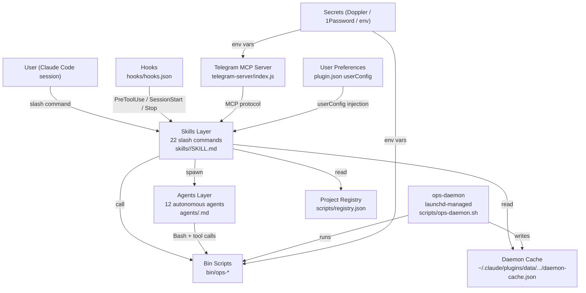

<!-- generated-by: gsd-doc-writer -->
# Architecture

claude-ops is a Claude Code plugin (v1.0.0) that installs as a business operating system on top of the Claude Code CLI. It exposes 22 slash-command skills that orchestrate 12 autonomous agents, a persistent background daemon, and a bundled Telegram MCP server. The primary inputs are tool calls from Claude Code sessions; the primary outputs are structured reports, drafted communications, and autonomous code/infrastructure actions executed via shell and API calls.

---

## Component Diagram



---

## Data Flow

A typical `/ops:go` morning briefing flows as follows:

1. **SessionStart hook** — `hooks/hooks.json` fires `bin/ops-welcome` (displays setup status) and `scripts/setup.sh` (surfaces any unresolved configuration issues).
2. **Skill invocation** — the user runs `/ops:go`; the `skills/ops-go/SKILL.md` skill is loaded by Claude Code.
3. **Cache read** — the skill calls `bin/ops-gather` (or reads the pre-warmed `daemon-cache.json` written by the daemon's `briefing-pre-warm` service every 2 minutes).
4. **Agent fan-out (optional)** — for deeper analysis (`/ops:yolo`), the skill spawns 4 parallel agents (CEO, CTO, CFO, COO) via the Claude Agent SDK. Each agent runs independently using `claude-opus-4-6` and writes its analysis to a temp file.
5. **Merge + present** — the main skill orchestrator reads all agent output files, merges them into a unified report, and returns it to the user in the Claude Code session.
6. **Stop hook** — `bin/ops-post-session-cleanup` runs on session end to clean up temp files and stale PIDs.

For communication skills (`/ops:inbox`, `/ops:comms`), a PreToolUse hook (`bin/ops-pretool-wacli-health`) checks the WhatsApp daemon health file before any `wacli` Bash call and surfaces a warning if the sync is stale (>10 min).

---

## Key Abstractions

| Abstraction | Location | Description |
|-------------|----------|-------------|
| `plugin.json` | `claude-ops/.claude-plugin/plugin.json` | Plugin manifest: name, version, `userConfig` schema (20 configurable keys), MCP server declarations |
| `SKILL.md` | `claude-ops/skills/<name>/SKILL.md` | Each skill is a markdown prompt file loaded by Claude Code as a slash command |
| Agent `.md` files | `claude-ops/agents/<name>.md` | Each agent is a markdown prompt file with frontmatter declaring model, effort, maxTurns, and memory scope |
| `hooks.json` | `claude-ops/hooks/hooks.json` | Declares SessionStart, PreToolUse (Bash matcher), and Stop lifecycle hooks |
| `registry.json` | `claude-ops/scripts/registry.json` | User-maintained project index with alias, repo, infra platform, revenue model, and GSD flag per project |
| `ops-daemon.sh` | `claude-ops/scripts/ops-daemon.sh` | Shell supervisor for 7 persistent background services; managed via launchd |
| `daemon-cache.json` | `~/.claude/plugins/data/.../daemon-cache.json` | Pre-warmed briefing data written by `briefing-pre-warm` every 2 min; read by `/ops:go` for <3s load |
| `CLAUDE.md` | `claude-ops/CLAUDE.md` | Plugin-root rules (Rules 0–5) that override individual skill instructions for all agents |
| Telegram MCP server | `claude-ops/telegram-server/index.js` | Node.js MCP server providing MTProto user-auth Telegram access (personal account, not bot API) |

---

## Directory Structure Rationale

```
claude-ops/
├── .claude-plugin/
│   └── plugin.json        # Plugin manifest and userConfig schema
├── agents/                # 12 agent prompt files (.md) — spawned by skills
├── bin/                   # 22 shell/node scripts (ops-*) — the executable layer
├── docs/                  # Reference documentation for plugin internals
├── hooks/
│   └── hooks.json         # Lifecycle hook declarations (SessionStart, PreToolUse, Stop)
├── output-styles/         # Output formatting guides used by skills
├── scripts/               # Daemon, cron jobs, setup wizard, project registry
├── skills/                # 22 skill directories, each containing a SKILL.md prompt
├── telegram-server/       # Bundled MCP server for Telegram MTProto access
├── tests/                 # Bash test suite (no-secrets, skills-lint, hooks, bin-scripts)
├── CHANGELOG.md           # Version history
├── CLAUDE.md              # Plugin-root rules applied to all skills and agents
├── LICENSE                # MIT
└── package.json           # Runtime deps for bin .mjs scripts (telegram, playwright)
```

- **`skills/`** — User-facing layer. Each subdirectory is one slash command. Skills are markdown prompt files; they contain no executable code, only instructions for Claude.
- **`agents/`** — Background worker layer. Agent `.md` files are spawned by skills using the Claude Agent SDK. They have declared resource budgets (model, maxTurns, effort) and memory scopes.
- **`bin/`** — Executable layer. Shell and Node.js scripts that interact with external CLIs (`wacli`, `aws`, `gh`, `doppler`, `gog`) and APIs. Skills and agents call these via Bash tool calls.
- **`scripts/`** — Infrastructure layer. The daemon supervisor, launchd plists, cron scripts, and the project registry live here.
- **`telegram-server/`** — Bundled MCP server. Provides Telegram access via MTProto (personal account authentication, not bot tokens). Declared in `.mcp.json` and auto-started by Claude Code.
- **`hooks/`** — Automation layer. Three lifecycle hooks: SessionStart (welcome + setup check), PreToolUse/Bash (WhatsApp health check), and Stop (cleanup).
- **`tests/`** — Validation layer. Bash scripts that check for committed secrets, skill markdown lint, hook schema validity, and bin script executability. Run via `tests/run-all.sh`.

---

## Daemon Architecture

The `ops-daemon` is a launchd-managed supervisor that runs 7 background services continuously:

| Service | Cadence | Purpose |
|---------|---------|---------|
| `briefing-pre-warm` | every 2 min | Runs `bin/ops-gather` to keep `/ops:go` cache hot |
| `wacli-sync` | persistent | Keeps WhatsApp connected via wacli, auto-reconnects |
| `memory-extractor` | every 30 min | Spawns `memory-extractor` agent to refresh `memories/` |
| `inbox-digest` | every 15 min | Pre-classifies communications across all channels |
| `store-health` | every 10 min | Shopify orders and inventory polling (if configured) |
| `competitor-intel` | hourly | Background market and competitor monitoring |
| `message-listener` | persistent | Surfaces urgent patterns ("urgent", "ASAP", "fire", "down") |

The daemon installs at setup Step 2c — deliberately early — so the briefing cache is pre-warmed while the user completes the remaining integration configuration steps.

---

## Agent Model Assignments

| Agent class | Model | Use case |
|-------------|-------|----------|
| C-suite analysts (`yolo-ceo`, `yolo-cto`, `yolo-cfo`, `yolo-coo`) | `claude-opus-4-6` | High-depth strategic, technical, financial, operational analysis |
| Scanner, fix, and daemon agents | `claude-sonnet-4-6` | Efficient read-scan-report loops and targeted code fixes |
| `memory-extractor` | `claude-haiku-4-5-20251001` | High-frequency (every 30 min) low-cost contact extraction |

---

## Plugin Rule Enforcement

`claude-ops/CLAUDE.md` defines 6 rules (Rule 0 through Rule 5) that apply to every skill and agent in the plugin, overriding any conflicting instruction in individual files:

- **Rule 0** — No personal data ever committed (public open-source repo)
- **Rule 1** — Maximum 4 options per `AskUserQuestion` call
- **Rule 2** — Never delegate commands to the user; use Bash tool instead
- **Rule 3** — Never auto-skip channels or integrations during setup
- **Rule 4** — Background by default during setup and configuration flows
- **Rule 5** — Destructive actions require explicit per-action confirmation
